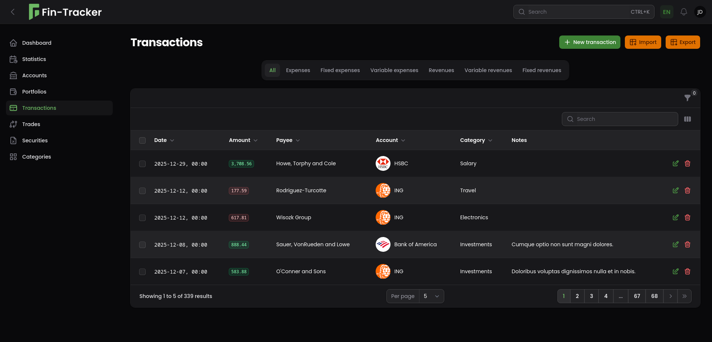
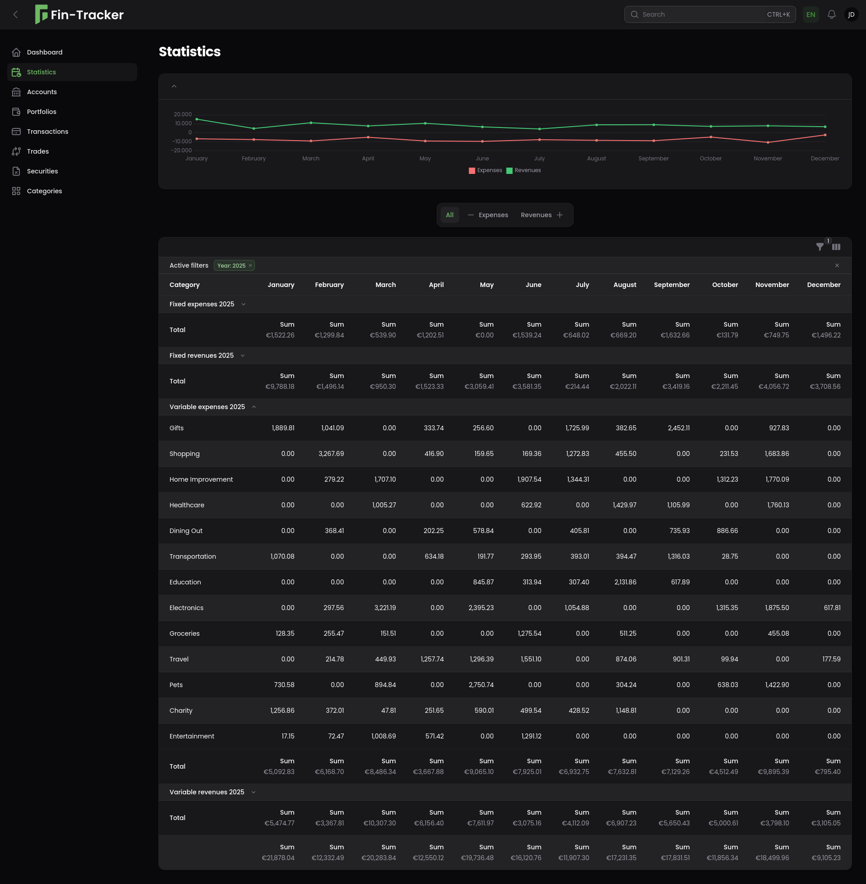
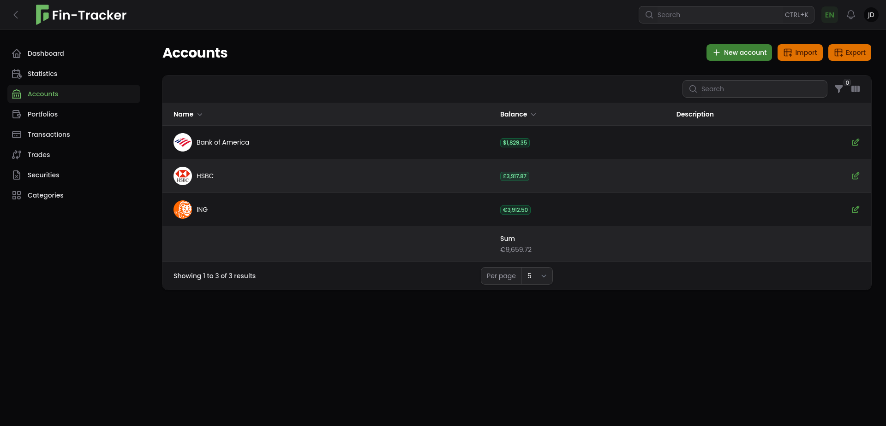

<div align="center">


<h1>Household Finance Manager</h1>

<p>
  <a href="https://github.com/barthjs/fin-tracker/releases">
    
  </a>
  <a href="https://github.com/barthjs/fin-tracker/blob/main/LICENSE">
    
  </a>
</p>


</div>

<hr>

<a id="readme-top"></a>

<details>
  <summary>Table of Contents</summary>
  <ol>
    <li><a href="#about">About</a></li>
    <li>
      <a href="#getting-started">Getting Started</a>
      <ul>
        <li><a href="#prerequisites">Prerequisites</a></li>
        <li><a href="#installation">Installation</a></li>
      </ul>
    </li>
    <li><a href="#configuration">Configuration</a></li>
    <li><a href="#screenshots">Screenshots</a></li>
    <li><a href="#updating">Updating</a></li>
    <li><a href="#backup">Backup</a></li>
    <li><a href="#contributing">Contributing</a></li>
    <li><a href="#development">Development</a></li>
    <li><a href="#built-with">Built With</a></li>
    <li><a href="#license">License</a></li>
  </ol>
</details>

## About

**Fin-Tracker** is a self-hostable, web-based household finance manager designed to help you monitor and organize your
finances across multiple bank accounts and investment portfolios.

### Features

- Track and visualize expenses and revenues from multiple bank accounts
- Record and manage trades across multiple investment portfolios
- Import and export data via CSV and Excel
- Multi-user support
- Fully containerized and ready for self-hosting with Docker

## Getting Started

### Prerequisites

- [Docker](https://docs.docker.com/engine/install/)
- [Docker Compose](https://docs.docker.com/compose/install/)

### Installation

1. Create an app directory:

    ```shell
    mkdir -p /opt/fin-tracker
    cd /opt/fin-tracker
    ```

2. Create a `.env` file using the values from the [.env.example](.env.example) and adjust it as needed. If
   you plan to use a different database, ensure you set the correct `DB_CONNECTION` in the `.env` file.

    ```shell
    curl https://raw.githubusercontent.com/barthjs/fin-tracker/main/.env.example -o .env
    ```

3. Download the [compose.yaml](compose.yaml) file.

    ```shell
    curl https://raw.githubusercontent.com/barthjs/fin-tracker/main/compose.yaml -o compose.yaml
    ```

4. Start the application:

    ```shell
    docker compose up -d
    ```

5. Log in at  [http://localhost](http://localhost) using the default credentials:

    - **Username**: `admin`
    - **Password**: `admin`

Upon the first login, you will be redirected to the profile page to change the default password.

## Configuration

Use the `.env` file to adjust configuration settings:

| Environment variable     | Default          | Description                                                                                       |
|--------------------------|------------------|---------------------------------------------------------------------------------------------------|
| `APP_KEY`                | (required)       | Key used to encrypt and decrypt data. Generate with: `echo -n 'base64:'; openssl rand -base64 32` |
| `APP_ALLOW_REGISTRATION` | `false`          | Enable/disable user self-registration                                                             |
| `APP_DEFAULT_CURRENCY`   | `EUR`            | Currency to use when creating new users (ISO 4217).                                               |
| `LOG_CHANNEL`            | `stdout`         | `stdout` logs to Docker, whereas `file` writes to `/app/storage/fin-tracker.log`                  |
| `LOG_LEVEL`              | `warning`        | Log level: `debug`, `info`, `warning`, `error`                                                    |
| `DB_CONNECTION`          | `pgsql`          | Database driver: `pgsql` or `mariadb`                                                             |
| `DB_HOST`                | `fin-tracker-db` | Database host name (service or container name in Docker Compose).                                 |
| `DB_PORT`                | `5432`           | Database port (`5432` for pgsql, `3306` for mariadb).                                             |
| `DB_DATABASE`            | `fin-tracker`    | Database name                                                                                     |
| `DB_USERNAME`            | `fin-tracker`    | Database username                                                                                 |
| `DB_PASSWORD`            | (required)       | Database password                                                                                 |

## Screenshots



<p align="right">(<a href="#readme-top">back to top</a>)</p>  



<p align="right">(<a href="#readme-top">back to top</a>)</p>  



<p align="right">(<a href="#readme-top">back to top</a>)</p>

## Updating

Before updating to a new major version, it is recommended to export your data using the CSV export feature.

Always check the changelog for any breaking changes or new configuration options.

```shell
cd /opt/fin-tracker
docker compose pull && docker compose up -d
```

## Backup

Back up all Docker volumes used in the [compose.yaml](compose.yaml) as well as the `.env`.

## Contributing

Contributions are welcome. If you encounter a bug, have a feature request, or need support, feel free
to [open an issue](https://github.com/barthjs/fin-tracker/issues/).

Please read the [contributing guidelines](CONTRIBUTING.md) for more details.

## Development

See the [CONTRIBUTING.md](CONTRIBUTING.md) for details on how to setup a development environment.

## Built With

- <a href="https://php.net" target="_blank">
    
  </a>
- <a href="https://laravel.com" target="_blank">
    
  </a>
- <a href="https://filamentphp.com/" target="_blank">
    
  </a>
- <a href="https://tabler.io/icons" target="_blank">
    
  </a>

## License

Distributed under the MIT License. See [LICENSE](LICENSE) for more information.

<p align="right">(<a href="#readme-top">back to top</a>)</p>
